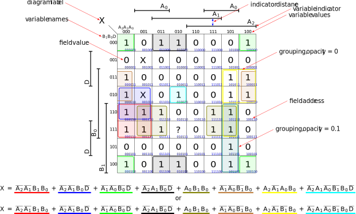
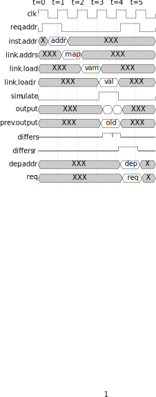
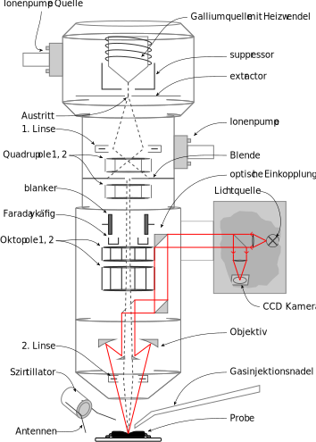
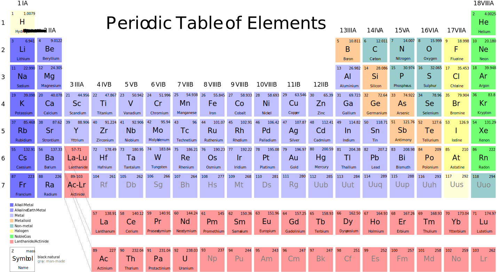
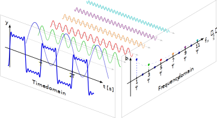

= docker-tikz2svg

A Docker image that converts PGF/TikZ to JPEG, PDF, PNG, or SVG.

== Build

 docker build -t tikz2svg

== Run

=== JPEG

 docker run --rm -i tikz2svg jpeg <input.tex >output.jpeg

=== PDF

 docker run --rm -i tikz2svg pdf <input.tex >output.pdf

=== PNG

 docker run --rm -i tikz2svg png <input.tex >output.png

=== SVG

 docker run --rm -i tikz2svg svg <input.tex >output.svg

== Examples

=== Complete Graph

.Generated from: link:examples/complete-graph/input.tex[]

=== Karnaugh Diagram

.Generated from: link:examples/karnaugh-diagram/input.tex[]

=== Timing Diagram

.Generated from: link:examples/timing-diagram/input.tex[]

=== Focused Ion Beam System

.Generated from: link:examples/focused-ion-beam-system/input.tex[]

=== Periodic Table

.Generated from: link:examples/periodic-table/input.tex[]

=== Fourier Series

.Generated from: link:examples/fourier-series/input.tex[]

== References

The following references were helpful in developing this.

* Various recommendations TikZ to SVG
+
https://tex.stackexchange.com/questions/51757/how-can-i-use-tikz-to-make-standalone-svg-graphics

* Post on dvisvgm integration
+
https://www.andrewheiss.com/blog/2021/08/27/tikz-knitr-html-svg-fun/
