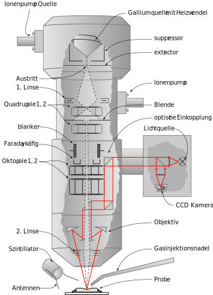
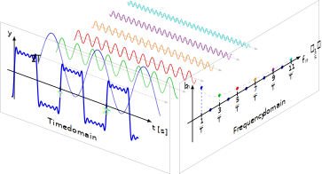

= docker-tikz2svg

A Docker image that converts a TikZ picture to an SVG.

== Build

 docker build -t tikz2svg .

== Run

[source,sh]
----
docker run \
    --rm \
    --interactive \
    --attach stdin \
    --attach stdout \
    --attach stderr \
    tikz2svg \
    <input.tex \
    >output.svg
----

== Examples

=== Complete Graph

.Generated from: link:examples/complete-graph/input.tex[]
image::examples/complete-graph/output.svg[]

=== Karnaugh Diagram

.Generated from: link:examples/karnaugh-diagram/input.tex[]
image::examples/karnaugh-diagram/output.svg[]

=== Timing Diagram

.Generated from: link:examples/timing-diagram/input.tex[]
image::examples/timing-diagram/output.svg[]

=== Focused Ion Beam System

.Generated from: link:examples/focused-ion-beam-system/input.tex[]

=== Periodic Table

.Generated from: link:examples/periodic-table/input.tex[]
image::examples/periodic-table/output.svg[]

=== Fourier Series

.Generated from: link:examples/fourier-series/input.tex[]

== References

The following references were helpful in developing this.

* Various recommendations TikZ to SVG
+
https://tex.stackexchange.com/questions/51757/how-can-i-use-tikz-to-make-standalone-svg-graphics

* Post on dvisvgm integration
+
https://www.andrewheiss.com/blog/2021/08/27/tikz-knitr-html-svg-fun/
