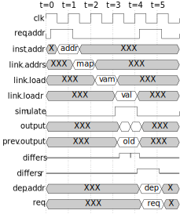

= docker-tikz2svg

A Docker image that converts a TikZ picture to an SVG.

== Build

 docker build -t tikz2svg .

== Run

=== Using the tikz2svg Helper Script

This is the recommended flow.

[source,sh]
----
docker run \
    --rm \
    --interactive \
    --attach stdin \
    --attach stdout \
    --attach stderr \
    tikz2svg \
    <input.tex \
    >output.svg
----

=== Using latex and dvisvgm Directly

This flow is useful for debug.

[source,sh]
----
docker run \
    --rm \
    --user $(id -u):$(id -g) \
    --volume "$PWD":/src \
    --workdir /src \
    tikz2svg \
    latex example.tex

docker run \
    --rm \
    --user $(id -u):$(id -g) \
    --volume "$PWD":/src \
    --workdir /src \
    tikz2svg \
    dvisvgm --font-format=woff example.dvi

file example.svg
----

== Examples

== References

The following references were helpful in developing this.

* Various recommendations TikZ to SVG
+
https://tex.stackexchange.com/questions/51757/how-can-i-use-tikz-to-make-standalone-svg-graphics

* Post on dvisvgm integration
+
https://www.andrewheiss.com/blog/2021/08/27/tikz-knitr-html-svg-fun/
